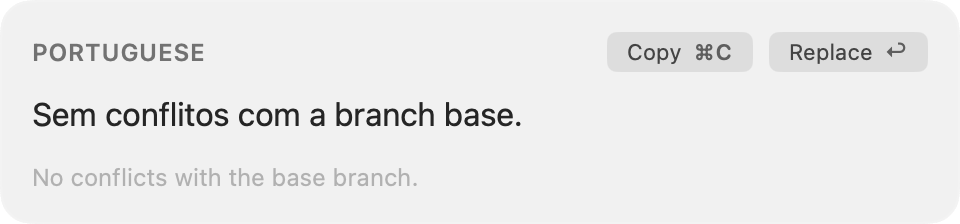
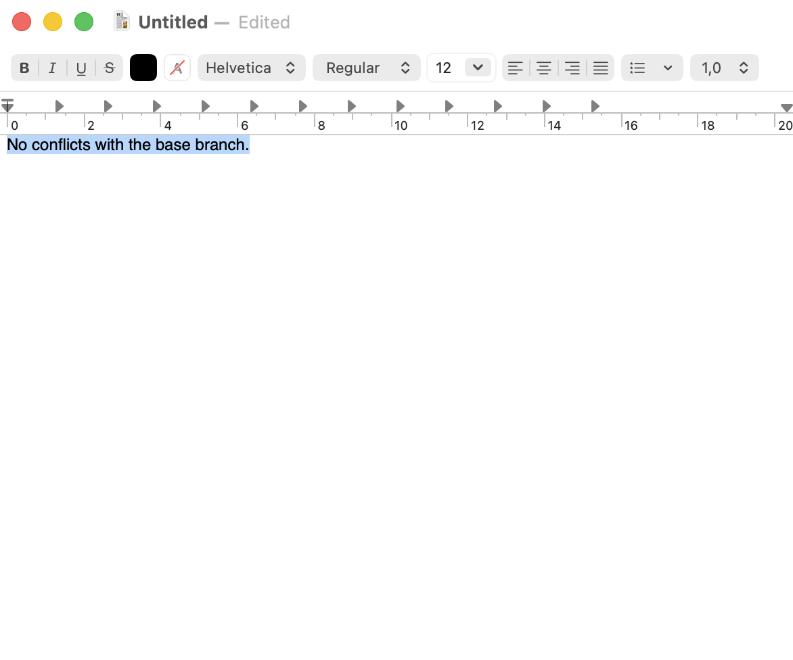
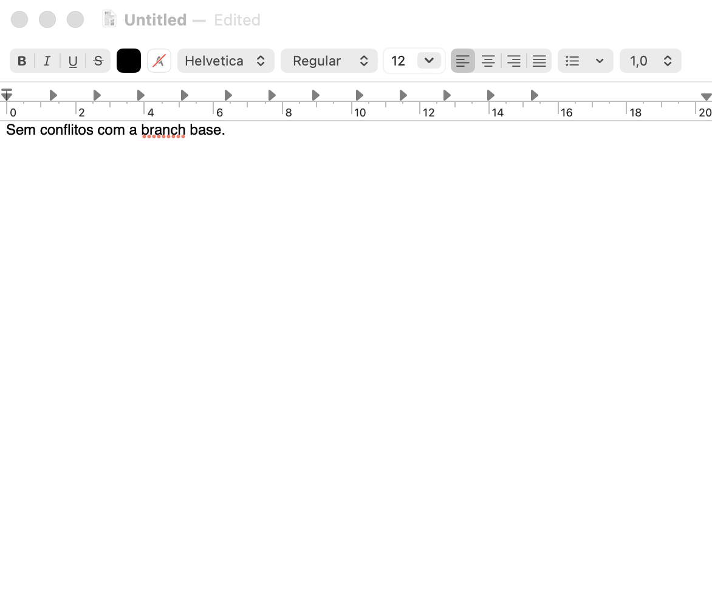

# Translate

A menu bar translator for Mac.
Select text, press a shortcut, and replace it where it was.

Tokens stream into a small overlay.
Return replaces the selection.
⌘C copies.
The field you were in keeps focus.



`branch` stays `branch`.
Portuguese means Brazilian Portuguese, not Spanish.

## The loop

1. Select text in any app Accessibility can read.

   

1. Press the shortcut.
   The overlay streams the translation.

1. Press Return to write it back, or ⌘C to copy.

   

Default shortcuts are ⌘⌥I (English) and ⌘⌥U (Portuguese).
Record your own in Settings.

## Engines

- **Local** — Qwen3-4B on MLX at `127.0.0.1:8765`. Offline, streamed.
- **Apple Translate** — on-device, the same engine as Apple's Translate app.
- **Claude** / **Codex** — the CLIs you already have.

Start the local server with `local-translate-server start` if you use Local.

## Build

Needs macOS 14+.
Install the `.app` into `/Applications` so Accessibility sticks to a stable path.

```bash
xcodegen generate
xcodebuild -scheme Translate \
  -destination 'platform=macOS,arch=arm64' \
  -configuration Debug \
  CONFIGURATION_BUILD_DIR="$PWD/build" \
  build
ditto build/Translate.app /Applications/Translate.app
xattr -cr /Applications/Translate.app
open /Applications/Translate.app
```

Turn Translate on in System Settings → Privacy & Security → Accessibility.
Select some text and press the shortcut.
